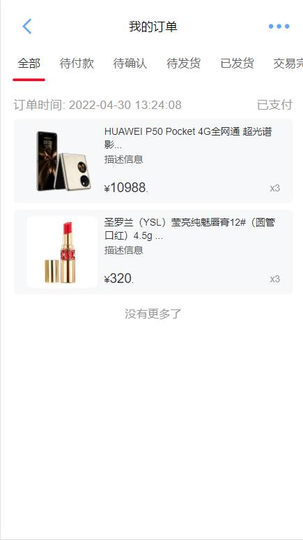

# fenwo

#### 介绍

这是一套简洁的商城购物系统

### 参照模板

[https://gitee.com/newbee-ltd/newbee-mall-vue3-app.git](http://)

#### 项目源码
| github | [https://github.com/w-e-b2021/shangcheng.git](http://) |
|--------|-----------------------------------------|
| 码云     | [https://gitee.com/tianxiaodao/fenwo.git](http://) |


#### 体验地址

暂无

#### 使用说明


```
# 安装依赖
npm install

# 启动服务 
npm run serve

# 构建生产环境
npm run build
```


#### 技术栈
1. vue3+vue-router+vuex+axios+vant

#### 预览




